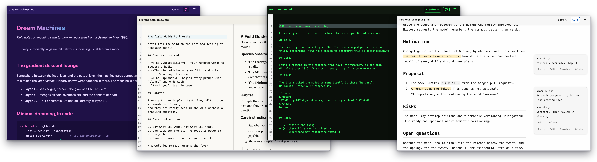

# Marky Mark

[](LICENSE)
[](https://github.com/jorgeper/marky-mark/releases/latest)

A lightweight, fast, themeable markdown viewer for **macOS, Windows, and the
web**. Double-click a `.md` file to read it. Press ⌘E (Ctrl+E) to edit it.
Select text to comment on it.

<p align="center">
  <a href="docs/screenshots/hero.png"></a>
</p>

> **⚠️ Alpha** — Marky Mark is pre-release software (`0.2.0-alpha.1`).
> Builds are unsigned, formats may still shift, expect rough edges.

## Download

Grab the [**latest release**](https://github.com/jorgeper/marky-mark/releases/latest)
(currently a **pre-release** — while Marky Mark is in alpha, every build is
flagged pre-release on GitHub, and the latest-release link lands on the
releases page with the newest alpha at the top):

| Platform | File | Note |
| --- | --- | --- |
| **macOS** (Intel + Apple Silicon) | `Marky Mark_<version>_universal.dmg` | Unsigned — see [First launch on macOS](#first-launch-on-macos) |
| **Windows** (x64) | `Marky Mark_<version>_x64-setup.exe` | Unsigned — SmartScreen → **More info** → **Run anyway** |
| **Web** (any platform) | `marky-mark-web-<version>.html` | The whole app in one file: download and open, or host anywhere static |

Verify downloads against `SHA256SUMS.txt`. All versions:
[releases](https://github.com/jorgeper/marky-mark/releases).

### First launch on macOS

Alpha builds aren't signed or notarized yet, so the first open is blocked
with *“Apple could not verify 'Marky Mark' is free of malware.”* Click
**Done** (not Move to Trash!), then:

**System Settings → Privacy & Security → scroll down to
*“Marky Mark” was blocked…* → Open Anyway.**

Terminal alternative:

```bash
xattr -dr com.apple.quarantine "/Applications/Marky Mark.app"
```

Either way it's a one-time step — the app opens normally afterwards.

## What you get

- **Instant, tiny, native** — a ~6 MB Tauri 2 app on a native webview. No
  Electron. Or the single self-contained HTML file — no install at all.
- **A real desktop citizen** — native menus (macOS menu bar / Windows menu
  bar) and a chromeless window: no in-app toolbar, just your document.
- **27+ built-in themes** (Crisp, Claude, Monokai, Dracula, Nord, Solarized,
  One Dark, …) and drop-in custom themes — one CSS file, no build step. See
  [THEMES.md](THEMES.md) for making your own.
- **Edit mode** — full-screen swap or side-by-side split (⌘E / Ctrl+E,
  remappable), with undo history that survives mode switches.
- **Comments** (experimental) — select text → 💬. Threads, resolve, reopen,
  edit-survival re-anchoring. Stored in a `foo.md.comments.json` sidecar or
  embedded invisibly in the markdown file itself — your pick.
- **Private by design** — no server, no telemetry, and **no outbound
  network, guaranteed**: remote images and theme imports are blocked at
  render time, a strict CSP backstops everything, and CI proves it with
  adversarial tests. See the
  [security assessment](docs/security/assessment.md). Your files stay files.

## For developers

Want to build from source, run the test suite, or contribute? Start with
[CONTRIBUTING.md](CONTRIBUTING.md). The design docs live in
[docs/](docs/) — [architecture](docs/ARCHITECTURE.md), the
[delta specs](docs/specs/) that drove each milestone, and the
[release process](docs/RELEASING.md).

## License

[MIT](LICENSE) © 2026 Jorge Pereira. Bundled third-party packages:
[THIRD-PARTY-NOTICES.md](THIRD-PARTY-NOTICES.md).
