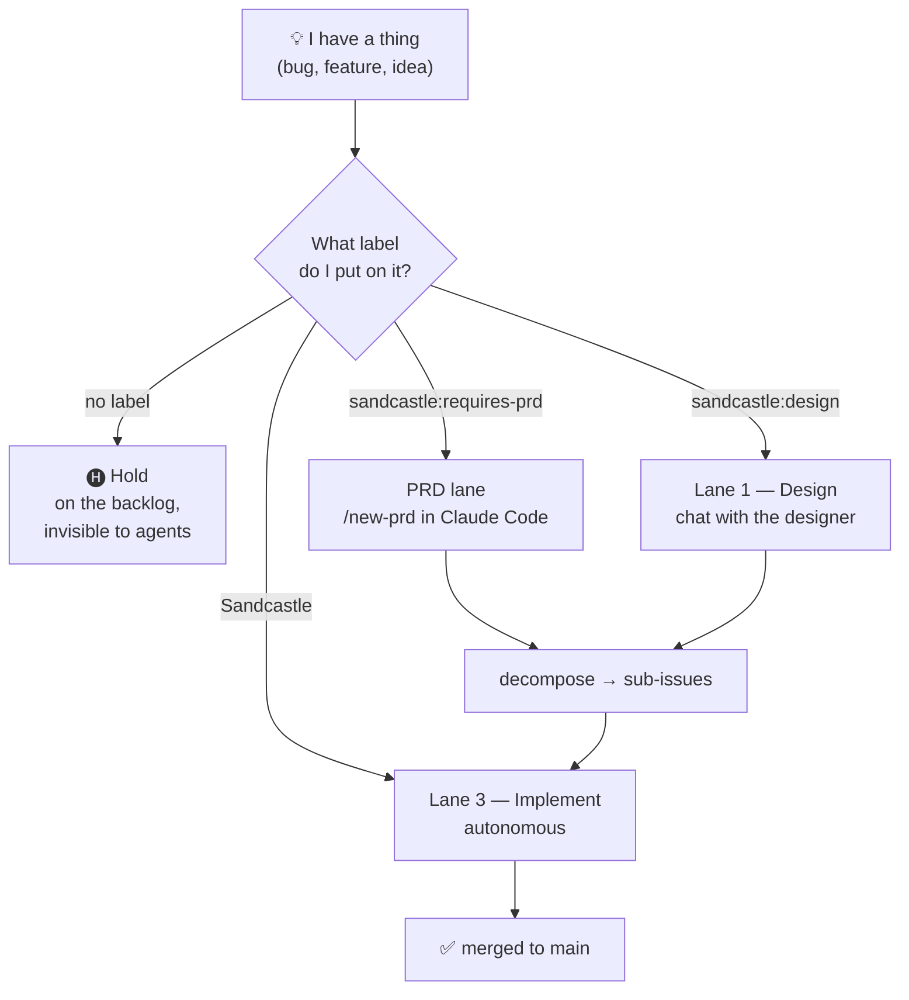
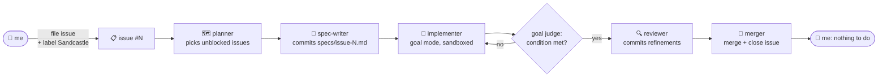
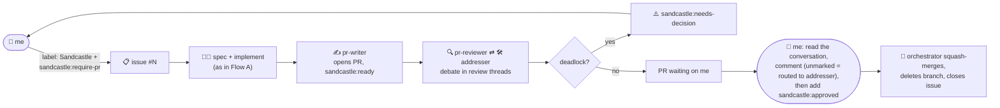
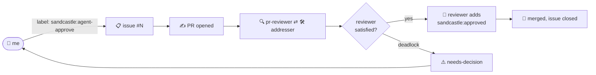
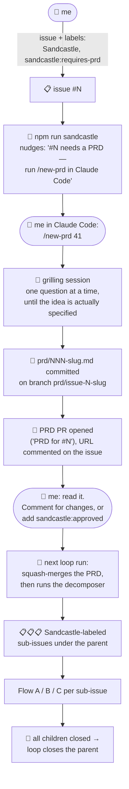
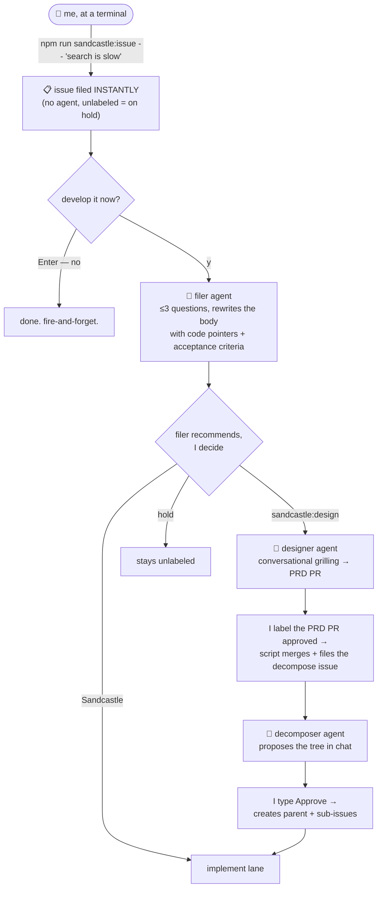
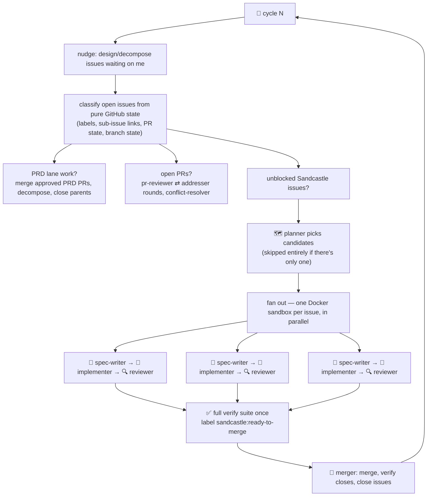
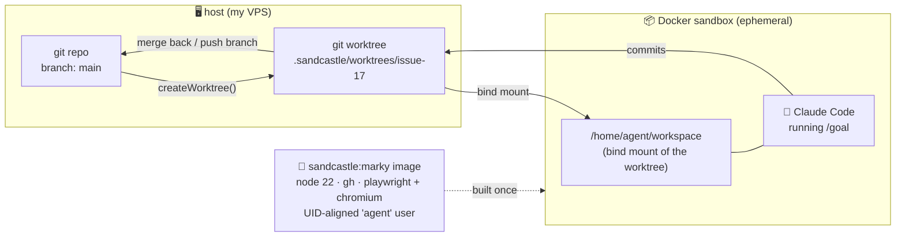
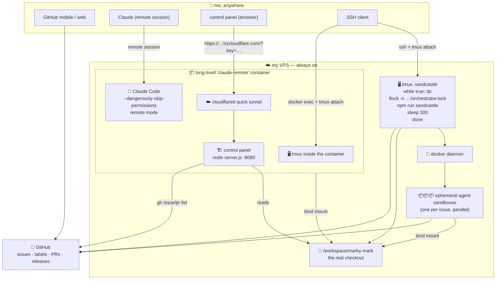

# Building Marky Mark with Sandcastle

### How I ship a desktop app from my phone, with a fleet of AI agents that never sleep

> 📖 **Illustrated version:** [how-marky-mark-is-built.html](./how-marky-mark-is-built.html)
> — same article with hand-drawn diagrams. That's the one you want.
>
> ⚠️ **This is a work in progress and an exploration.** Nothing here is a
> product, a recommendation, or a finished methodology. It's a log of what
> I've built so far, what worked, and what I'm still figuring out. Some of
> it will look silly in three months. That's the point.

---

## The one-paragraph version

[Marky Mark](https://github.com/jorgeper/marky-mark) is a fast, themeable
markdown viewer for macOS, Windows and the web. I write almost none of it by
hand. Instead I file GitHub issues, and a fleet of AI agents — orchestrated by
a fork of [Matt Pocock's Sandcastle](https://github.com/mattpocock/sandcastle)
running 24/7 on a VPS — picks them up, writes a spec, implements against it in
a Docker sandbox, reviews the diff, argues about it on a pull request, and
merges. My job is deciding *what* to build and saying yes or no. I can do
that entirely from my phone.

---

## Part 1 — What Sandcastle is (the original)

[Sandcastle](https://github.com/mattpocock/sandcastle) is a TypeScript library
by Matt Pocock for **orchestrating AI coding agents inside isolated
sandboxes**. Its pitch is three lines long:

1. You invoke an agent with a single `sandcastle.run()`.
2. Sandcastle sandboxes the agent with a configurable branch strategy.
3. The commits the agent makes on its branch get merged back.

That's it. It's not an app, it's not a SaaS, it's a library you script.

```typescript
import { run, claudeCode } from "@ai-hero/sandcastle";
import { docker } from "@ai-hero/sandcastle/sandboxes/docker";

await run({
  agent: claudeCode("claude-opus-4-8"),
  sandbox: docker(),
  promptFile: ".sandcastle/prompt.md",
});
```

### The vocabulary

Sandcastle is unusually disciplined about its own language (it ships a
`CONTEXT.md` glossary), and the terms matter for everything below:

| Term | Meaning |
| --- | --- |
| **Host** | Your machine. The real git repo lives here. |
| **Sandbox** | The isolation boundary — a container or VM the agent runs inside. |
| **Agent** | The AI coding tool in the sandbox (Claude Code, Codex, …). Swappable. |
| **Sandbox provider** | Pluggable implementation that creates sandboxes: `docker()`, `podman()`, `vercel()`, `noSandbox()`, or your own. |
| **Worktree** | A git worktree in `.sandcastle/worktrees/` on the host, bind-mounted into the sandbox. |
| **Branch strategy** | How the agent's commits relate to branches: `head` (work in place), `merge-to-head` (temp branch, merged back), `branch` (a named branch). |
| **Target branch** | The branch the host is on when `run()` is called — where work merges back to. |

### The important architectural idea

The agent never touches your working directory. Sandcastle creates a **git
worktree** on the host, **bind-mounts** it into a container, runs the agent in
there with no access to anything else, and then merges the resulting commits
back into the target branch. The blast radius of a confused agent is one
worktree and one branch.

Because the worktree is a real git worktree on the host, **git is the memory
bus**. An agent that dies mid-task leaves committed work behind; the next
agent starts from that state. You get crash-safety and resumability for free,
without a database.

### Templates: the orchestration layer

`npx sandcastle init` scaffolds a `.sandcastle/` directory containing a
*template* — a script you own and can edit, built on the library. The
interesting one is the **parallel planner**: a loop that reads GitHub issues
labeled `Sandcastle`, plans which ones are unblocked, fans out one sandboxed
implementer per issue **in parallel**, runs a reviewer, and merges. Then it
does it again. And again.

This is the "RALPH" lineage — keep spawning agents at a backlog until the
backlog is empty. Sandcastle's contribution is making each spawn *isolated*,
*branch-aware*, and *scriptable*.

---

## Part 2 — What I changed (the fork)

My fork is [jorgeper/sandcastle](https://github.com/jorgeper/sandcastle). Every
change lives on its own `feat/*` branch so it can be proposed upstream
individually, and `README-FORK.md` records them newest-first.

Upstream Sandcastle starts at *"here is a labeled issue."* Almost everything I
added is about the two halves that sentence hides: **how does an idea become a
good issue**, and **how do I trust what comes out the other end?**

### 2.1 The front half — from idea to issues

| Addition | What it does |
| --- | --- |
| **PRD-driven workflow** | `/new-prd` and `/decompose-prd` Claude Code skills, scaffolded into the repo by `init`. Grill me into a PRD, commit it, then propose a parent issue + N labeled sub-issues with dependency edges, wired with GitHub's real sub-issues API. |
| **Conversation gateway** | A durable, turn-based conversation engine (`conversation.start()/open()/send()`) plus an Ink chat TUI. You can *talk to* a sandboxed agent instead of driving a TUI by hand. Every message is persisted before the agent runs, so Ctrl-C is always safe. |
| **Designer / decomposer / filer lanes** | Three conversational agents: the **filer** turns a one-line report into a well-formed, routed issue; the **designer** grills you into a PRD and opens the PRD PR; the **decomposer** proposes the issue tree and only creates it after you type Approve. |
| **Label-routed PRD lane** | The no-chat alternative: label an issue `sandcastle:requires-prd`, and the main loop nudges you to run `/new-prd` in your own Claude session. Approve the PRD PR with a label and the loop merges it and decomposes it autonomously. |

The unifying rule: **everything is a GitHub issue, and a routing label decides
which agent handles it.** There is one inbox.

### 2.2 The back half — trust, review, and merge gates

| Addition | What it does |
| --- | --- |
| **PR checkpoint + review debate** | Label an issue `sandcastle:require-pr` and the work lands on a pull request instead of auto-merging. A `pr-reviewer` agent and an `addresser` agent then *debate in the PR's review threads* until threads resolve. Deadlocks escalate as `⚠️ NEEDS-DECISION` for me to arbitrate. Turn-taking and the merge gate are pure, unit-tested code — not prompt interpretation. |
| **Agent-approved PRs** | `sandcastle:agent-approve`: same PR + debate, but when the reviewer has nothing outstanding it posts an "approving on behalf of the owner" comment and applies `sandcastle:approved` itself. The next loop merges. No human touch — but deadlocks still stop and wait for me. |
| **One shared review bar** | Both reviewers (branch reviewer and PR reviewer) read the same `review-checklist.md`: correctness, clarity, balance, standards, preserve-functionality. |
| **Goal mode** | Replaces "spawn agents and substring-match their own claim of completion" with Claude Code's native `/goal` engine: a *separate evaluator model* judges the completion condition after every turn. A spec-writer step first distills each issue into a committed `specs/issue-<n>.md` whose `## Goal` section is the condition. Unverified work (`goalMet: false`) never reaches the PR or merge phases. |
| **Marker convention** | Everything an agent writes on GitHub under my identity starts with `**[agent · harness · model]**`. Unmarked = a human wrote it. That's also how the scripts tell my PR comments from agent replies and route mine back to the addresser. |

### 2.3 Making it survive contact with reality

This is the unglamorous half, and it's most of the diff. Every entry below
came from watching a real run go wrong:

- **`sandcastle:ready-to-merge`** — a crash after an issue was implemented,
  reviewed and gate-verified used to re-run the whole implementer just to
  re-prove finished work. Now the orchestrator records "goal met" as a durable
  label and the next cycle routes straight to merge.
- **Merged-issue safety net** — an issue whose branch was merged but which
  never got closed looped forever. Three derive-from-git fixes closed it.
- **Prompt-arg tripwire** — a test that asserts every `{{PLACEHOLDER}}` in
  every prompt has a matching argument. It immediately found two latent
  crashes, one of which killed the entire loop process.
- **Timing instrumentation + the `sandcastle-analyze` skill** — every log line
  is timestamped, every agent run appends `{ts, phase, ms, ok, issue}` to
  `timings.jsonl`, and a scaffolded skill reads all of it and tells me where
  the wall-clock went and what to change.
- **Tiered verification** — `QUICK_VERIFY_COMMANDS` (typecheck + unit) for the
  inner loop, the full `VERIFY_COMMANDS` exactly once before declaring done.
  Runs got dramatically cheaper.
- **Image-gap nudge** — installs inside a sandbox die with the container. The
  loop scans its own logs for install signatures (`playwright install`,
  `apt-get`, `npm i -g`), tallies repeats per image id, and prints the exact
  Dockerfile line that would fix it. *Rule: image = toolchain, worktree =
  project deps, hooks = cheap glue.*
- **Per-repo customization** — `.sandcastle/config.mts` holds every knob as
  plain TS consts; `init` detects your toolchain (node / react-web / tauri /
  go / python) and proposes verify commands scanned from your real
  `package.json`.
- **`--doctor`** — one command that checks env vars, that the GitHub token can
  actually *read issues* (a contents-only PAT authenticates fine and then
  strands every agent), the Docker image, the label vocabulary, whether the
  implementer skill is committed, and whether the verify commands exist.
- **Still-running heartbeat** — with four issues in flight the console went
  silent for eight minutes and I "fixed" it by killing live agents. Now it
  prints `⏳ still running: implementer(issue=22) 12.3m` every two minutes.

---

## Part 3 — The flows

There is exactly **one inbox** (GitHub issues) and **one routing decision**
(which label). Everything else follows from that.

### 3.0 The router



Two extra labels modify the implement lane rather than routing it:
`sandcastle:require-pr` (land on a PR and wait for me) and
`sandcastle:agent-approve` (land on a PR and let the reviewer approve it).

### 3.1 Flow A — the small thing (auto-merge)

The default. I file an issue, label it `Sandcastle`, and walk away.



**My touchpoints: 1.** Filing the issue. That's the whole flow.

### 3.2 Flow B — the thing I want to look at (`sandcastle:require-pr`)



**My touchpoints: 2–3.** Label it, read the PR conversation, approve with a
label. I never press GitHub's merge button — the orchestrator does, and only
when the label is on and zero threads are unresolved.

> Why a label and not GitHub's Approve button? Every PR is authored by my own
> identity, and GitHub won't let you approve your own PR. The label *is* the
> gate.

### 3.3 Flow C — the thing I trust the agents with (`sandcastle:agent-approve`)

Identical to Flow B, with one difference: when the reviewer has nothing
outstanding and every thread is resolved, **it applies `sandcastle:approved`
itself** and posts a marked comment saying it's approving on my behalf. The
next loop merges.



**My touchpoints: 1** (or 2 if it deadlocks). I still get the full PR with a
review conversation to read later — the audit trail is identical, I just
didn't block the pipeline on my attention.

### 3.4 Flow D — the big thing (PRD lane)

This is the flow for anything I can't describe in a paragraph.



**My touchpoints: 3.** File + label. Run `/new-prd` and get grilled. Approve
the PRD with a label. Everything after that is autonomous — including the
decomposition into sub-issues, which I used to have to approve in a chat.

The grilling is the part that carries the most value. A twenty-minute
interview where an agent keeps asking *"what happens if the file is deleted
while it's open?"* produces a PRD that produces sub-issues that produce code I
don't have to rewrite.

### 3.5 Flow E — the conversational lanes (chat CLI)

The older, more interactive path. Still there, still useful when I want
arrow-key options and a back-and-forth rather than a Claude Code session.



The nice property here: **capture is instant and agent-free.** The issue
exists the moment I hit enter — the conversation is optional and can happen
days later. Ctrl-C anywhere is safe, because every message is persisted before
the agent runs.

### 3.6 Inside one loop iteration

What `npm run sandcastle` actually does, per cycle:



Every phase is wrapped in `timed()`, which prints a timestamped start/finish
line and appends a JSON record to `.sandcastle/logs/timings.jsonl`. That file
is what the control panel and the analyze skill read.

Critically, **every phase derives its state from GitHub and git, not from a
database.** Kill the loop at any point and the next run re-classifies from
scratch and picks up exactly where it was. That's what makes it safe to run
unattended.

---

## Part 4 — How a single agent run actually works



Three things make this work well in practice:

1. **The bind mount means `node_modules` survives.** `COPY_TO_WORKTREE`
   copies it in before the container starts; `INSTALL_COMMAND` tops it up.
2. **The image is the toolchain.** Chromium and Playwright's system deps are
   baked in with a shared `PLAYWRIGHT_BROWSERS_PATH`, so agents never
   re-download a browser. The image-gap nudge exists to catch when I forget
   this.
3. **The container user's UID/GID are aligned with the host user's** at build
   time, so bind-mounted files don't need a runtime `chown`.

---

## Part 5 — My deployment: 24/7, and reachable from a phone

This is the part that turns a local dev tool into something that works while
I'm asleep.



### Why each piece exists

**The VPS.** The loop needs to run when my laptop is closed. That's the whole
reason. A cheap always-on box turns "I ran some agents this afternoon" into "the
backlog drains overnight."

**tmux session #1 — the orchestrator loop.** On the VPS host (it needs the
Docker socket), a supervisor loop runs `npm run sandcastle` forever with a
five-minute pause between cycles, wrapped in `flock -n` on a lock file inside
the repo. The lock is what stops two orchestrators from ever running at once.

> **A genuinely annoying detail worth writing down:** the lock file lives at
> `.sandcastle/logs/orchestrator.lock`, *inside the repo*, not in `/tmp`. The
> control panel runs inside a container whose `/tmp` is its own overlay
> filesystem — a `/tmp` lock there is a different inode and shares nothing
> with the host. But the repo is bind-mounted into both, and `flock` locks the
> *inode* while the kernel is shared. So a repo-path lock is visible across the
> container boundary and `pgrep` never had to work.

**The `claude-remote` container.** A long-lived Docker container on the VPS
with Claude Code installed and the repo bind-mounted. Three reasons it exists:

1. **24/7** — it's on my VPS, so it's always up and always reachable.
2. **Remote mode** — I can open a session against it from my phone or any
   browser, and pick up exactly where I left off.
3. **`--dangerously-skip-permissions`** — because it's a container with a
   single bind-mounted repo and nothing else, I can run in YOLO mode without
   it being reckless. The container *is* the permission boundary. That's the
   same argument Sandcastle makes for its agent sandboxes, applied one level
   up to my own interactive session.

**tmux session #2 — inside that container.** I SSH to the VPS, `docker exec`
into the container, and attach to a tmux session where Claude Code is running.
It's not a glamorous touchpoint, but it's how I restart it after a crash and
how I grab the URL for a remote session.

**The control panel.** A ~500-line zero-dependency Node server plus a vanilla
JS single-page app, served through a Cloudflare quick tunnel with an access
key. It's the read-mostly view of everything (see Part 6).

### My actual touchpoints, ranked by how often I use them

| # | Touchpoint | What I do there |
| --- | --- | --- |
| 1 | **GitHub issues & PRs** (phone or web) | File issues, apply routing labels, read review debates, apply `sandcastle:approved` |
| 2 | **Claude Code, remote session** | `/new-prd` grilling sessions, `/release-mac`, `/gate`, ad-hoc "go look at this" work — and sometimes filing issues by just asking |
| 3 | **The control panel** (phone browser) | Watch which agents are running, tail logs, see the issue tree, start a Sandcastle run with the ▶ button |
| 4 | **tmux on the VPS host** | Run/restart the orchestrator loop, rebuild the Docker image, the occasional `git` surgery |
| 5 | **tmux inside the Claude container** | Restart Claude Code if it dies; fetch the remote-session URL |

Touchpoints 1–3 are all phone-friendly. That's the design goal: **the common
path never requires a terminal.**

---

## Part 6 — The control panel

I built this because the honest answer to "what are the agents doing right
now?" was `tail -f` over SSH, which is a terrible thing to do on a phone.

- **Agents tab** — every agent run, parsed straight out of
  `.sandcastle/logs/*.log` (split on `--- Run started ---` markers) and
  `timings.jsonl`. Role icons, durations, live badge, failure reasons pulled
  out of crash dumps and shown in red. Tap through to the log with a live tail.
- **Issues tab** — `gh issue list` plus the sub-issues REST API, rendered as a
  tree: parent → children → the PRs that close them, with agent chips per row.
- **PRs tab** — `gh pr list`, cross-linked back to issues by branch name.
- **The ▶ button** — starts `npm run sandcastle` detached under the same
  `flock`. If the host-side loop is already running, the button correctly shows
  a disabled "running" pill instead.
- **Access** — a `?key=…` once, then a cookie. There are no published ports on
  the VPS; a Cloudflare quick tunnel is the only external path.

One thing I removed on purpose: a "one-button remediation" feature that could
trigger `docker build-image` from the panel. The panel executes *inside* a
container where the Docker CLI doesn't exist, so it could only ever fail —
with a misleading error message, no less. Good reminder that a control panel
should mostly *observe*.

---

## Part 7 — Everything this thing can do

### From upstream Sandcastle

- Run any agent (Claude Code, Codex, …) inside a real sandbox.
- Swappable sandbox providers: Docker, Podman, Vercel microVMs, no-sandbox, or
  a custom one.
- Git worktrees + branch strategies, so agents never touch your working copy.
- **Parallel** agents — one sandbox per issue, fanned out per cycle.
- Templates you own and edit, scaffolded into `.sandcastle/`.
- Session resume / fork, structured output, keep-alive sandboxes.

### From my fork

- **A defined front half**: idea → filer → PRD → decomposition → labeled
  issues, with a real GitHub sub-issue tree from design issue down to
  implementation PR. Nothing exists without an issue that says why.
- **Goal mode** with an independent judge model — no more agents grading their
  own homework.
- **Committed specs** (`specs/issue-N.md`), SHA-pinned and linked from the
  issue, so I can read what the agent thought it was building.
- **PR checkpoints** with a genuine reviewer ⇄ addresser debate in review
  threads, and deadlock escalation to me.
- **Agent-approved merges** for work I don't need to gate.
- **Three merge policies per issue, chosen by label** — auto-merge, PR + my
  approval, PR + agent approval.
- **Full audit trail** — every agent action is a marked comment on the issue
  or PR. I can reconstruct any decision months later.
- **Crash-safe everywhere** — state lives in GitHub, git, and the conversation
  store. Kill anything at any time; the next run re-derives.
- **Timing instrumentation + an analyze skill** that reads it and proposes
  config changes.
- **Tiered verification** — fast checks in the inner loop, the full gate once.
- **`--doctor`** — the single command that tells me why it isn't working.
- **The image-gap nudge** — the loop notices when agents keep reinstalling
  something and tells me the Dockerfile line to add.
- **Per-repo config** in one plain-TypeScript file.
- **24/7 unattended operation** on a VPS, with the whole thing drivable from a
  phone.

---

## Part 8 — So what actually got built this way?

Marky Mark, as of this writing:

| | |
| --- | --- |
| Commits | **283**, over about four weeks (2026-07-08 → 2026-08-03) |
| Commits authored by an agent | **~40** carrying an agent author, **54** carrying the `RALPH:` agent-commit prefix |
| Issues filed | **26** |
| Committed specs | **11** (`specs/issue-N.md`) |
| Latest release | `v0.4.0-alpha.5` |
| What it is | A Tauri 2 markdown viewer/editor for macOS, Windows, and a single-file web build, with themes, margin comments, export, and print |

Things the agents built essentially unattended: theme work, the comment
system's margin layout and gutter rules, export/print HTML generation, the
Windows installer path, big chunks of the E2E suite, and most of the
documentation. Things I still drive myself: the visual design calls, the
release decisions, and anything where "correct" is a matter of taste rather
than a test.

---

## Part 9 — What's next

**Multiple harnesses and multiple models.** Sandcastle is provider-agnostic by
design, and the marker convention already records `[agent · harness · model]`
on every comment. The obvious next step is running the *same* work through
different harnesses and models — and more interestingly, running **adversarial
reviews**: have one model implement and a genuinely different model review,
rather than the same family grading itself. The review debate infrastructure
is already there; it just needs a different model on the other side of the
table.

**Cheaper cycles.** The timing data says a lot of wall-clock still goes to
verification and sandbox setup. There's more to win there.

**Upstreaming.** Every fork change lives on its own branch specifically so it
can be proposed to Matt's repo one piece at a time.

---

## Closing note

I want to be clear about what this is: **an exploration, in progress.** It's a
system I built for one person and one repo, and a lot of it is scar tissue
from specific failures rather than considered design. But the core shape —
*one inbox, routing labels, isolated sandboxes, git as the memory bus, and
merge gates that are code rather than vibes* — has held up better than I
expected.

The thing I did not anticipate: the hardest problems were never "can the model
write the code." They were **specification** (which is why the grilling
sessions matter), **verification** (which is why goal mode has a separate
judge), and **operations** (which is why half the fork is crash-recovery). The
model was rarely the bottleneck.

---

*Written 2026-08-03. Sandcastle is by [Matt Pocock](https://github.com/mattpocock/sandcastle);
the fork is [jorgeper/sandcastle](https://github.com/jorgeper/sandcastle);
the app is [jorgeper/marky-mark](https://github.com/jorgeper/marky-mark).*
