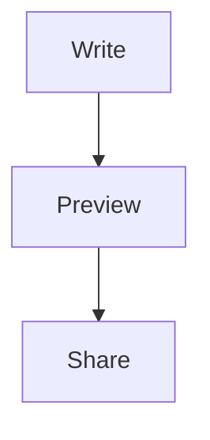

# Diagrams

Marky Mark draws fenced diagrams in place — in the preview and, with the
diagram view on, right in the editor. Click one to edit its source.



A diagram that does not parse keeps its source, with a note saying why:

```mermaid
this is not a diagram at all
```

Ordinary code blocks are untouched:

```js
const x = 1;
```
